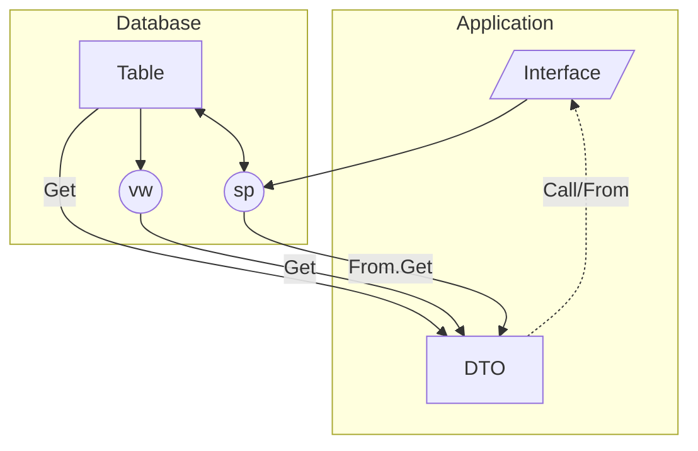

<div align="center">


</div>

# Pho/rm - The **P**rocedure-**h**eavy **o**bject-**r**elational **m**apping framework

[](https://github.com/IFYates/Phorm/actions/workflows/dotnet.yml)
[](https://www.codacy.com/gh/IFYates/Phorm/dashboard?utm_source=github.com&utm_medium=referral&utm_content=IFYates/Phorm&utm_campaign=Badge_Coverage)
[](https://dashboard.stryker-mutator.io/reports/github.com/IFYates/Phorm/main)
[](https://www.codacy.com/gh/IFYates/Phorm/dashboard?utm_source=github.com&amp;utm_medium=referral&amp;utm_content=IFYates/Phorm&amp;utm_campaign=Badge_Grade)

A full O/RM, focused on strong separation between the data structures and the business entity representation.

See our [ethos](https://github.com/IFYates/Phorm/wiki/ethos) for how and why Pho/rm is different to other O/RMs.

The [wiki](https://github.com/IFYates/Phorm/wiki) contains lots of useful examples of the various [features](https://github.com/IFYates/Phorm/wiki#feature-list), as well as a [getting started guide](https://github.com/IFYates/Phorm/wiki/getting-started).

Pho/rm supports:
* [Entity data mapping](https://github.com/IFYates/Phorm/wiki/howto-get)
* [Child entities](https://github.com/IFYates/Phorm/wiki/howto-get#resultsets)
* [Entity polymorphism](https://github.com/IFYates/Phorm/wiki/howto-get#genspec)
* [All CRUD operations](https://github.com/IFYates/Phorm/wiki/howto-call)
* [Transactions](https://github.com/IFYates/Phorm/wiki/howto-connectivity#transactions)
* [Logging unexpected behaviour](https://github.com/IFYates/Phorm/wiki/howto-events)
* [Your DI framework](https://github.com/IFYates/Phorm/wiki/howto-di)
* And more!

Packages|||
-|-|-
IFY.Phorm.Core|[](https://www.nuget.org/packages/IFY.Phorm.Core/)|[](https://www.nuget.org/packages/IFY.Phorm.Core/)
IFY.Phorm.SqlClient|[](https://www.nuget.org/packages/IFY.Phorm.SqlClient/)|[](https://www.nuget.org/packages/IFY.Phorm.SqlClient/)

## Driving principals
The are many, brilliant O/RM frameworks available using different paradigms for database interaction.  
Many of these allow for rapid adoption by strongly-coupling to the storage schema at the expense of control over the efficiency of the query and future structural mutability.  
As such solutions grow, it can become quickly difficult to evolve the underlying structures as well as to improve the way the data is accessed and managed.

Pho/rm was designed to provide a small and controlled surface between the business logic layer and the data layer by pushing the shaping of data to the data provider and encouraging the use of discrete contracts.  
Our goal is to have a strongly-typed data surface and allow for a mutable physical data structure, where responsibility of the layers can be strictly segregated.

With this approach, the data management team can provide access contracts to meet the business logic requirements, which the implementing team can rely on without concern over the underlying structures and query efficiency.



## Common example
For typical entity CRUD support, a Pho/rm solution would require a minimum of:
1. Existing tables in the data source
1. A POCO to represent the entity (DTO); ideally with a contract for each database action
1. A stored procedure to fetch the entity
1. At least one stored procedure to handle create, update, delete (though, ideally, one for each)

A simple Pho/rm use would have the structure:
```SQL
CREATE TABLE [dbo].[Data] (
    [Id] BIGINT NOT NULL PRIMARY KEY,
    [Key] NVARCHAR(50) NOT NULL UNIQUE,
    [Value] NVARCHAR(256) NULL
)

CREATE PROCEDURE [dbo].[usp_SaveData] (
    @Key NVARCHAR(50),
    @Value NVARCHAR(256),
    @Id BIGINT = NULL OUTPUT
) AS
    SET NOCOUNT ON
    INSERT INTO [dbo].[Data] ([Key], [Value])
        SELECT @Key, @Value
    SET @Id = SCOPE_IDENTITY()
RETURN 1 -- Success
```
```CSharp
// DTO and contracts
[PhormContract(Name = "Data")] // Name of underlying table (optional)
class DataItem : ISaveData
{
    public long Id { get; set; }
    public string Key { get; set; } = string.Empty;
    public string? Value { get; set; }
}
interface ISaveData : IPhormContract
{
    long Id { set; } // Output
    string Key { get; }
    string? Value { get; }
}

// Configure Pho/rm session to SQL Server
IPhormSession session = new SqlPhormSession(connectionString);

// Get all existing records from the table
DataItem[] allData = await session.GetAsync<DataItem[]>()!; // Table dbo.Data

// Add a new record to the table, getting back the new id
var newItem = new { Id = ContractMember.Out<long>(), Key = "Name", Value = "T Ester" };
int result = await session.CallAsync<ISaveData>(newItem); // Procedure dbo.usp_SaveData

DataItem? itemById = await session.GetAsync<DataItem>(new { Id = newItem.Id }); // Table dbo.Data
DataItem? itemByKey = await session.GetAsync<DataItem>(new { Key = "Name" }); // Table dbo.Data
```

## Syntax overview
```CSharp
IPhormSession
    // Calling a contract
    Task<int> CallAsync(string contractName, object? args = null, CancellationToken cancellationToken = CancellationToken.None);
    Task<int> CallAsync<TActionContract>(object? args = null, CancellationToken cancellationToken = CancellationToken.None);

    // Fetching from a DTO definition (table, view)
    Task<TResult?> GetAsync<TResult>(object? args = null, CancellationToken cancellationToken = CancellationToken.None);

    // Fetching from a named procedure
    From(string contractName, object? args = null)
        Task<TResult?> GetAsync<TResult>(CancellationToken cancellationToken = CancellationToken.None);
        // Resultset filtering
        Where<TEntity>(Expression<Func<TEntity, bool>> predicate)
            Task<IEnumerable<TEntity>> GetAllAsync(CancellationToken cancellationToken = CancellationToken.None);
    
    // Fetching from a contract definition (procedure, table, view)
    From<TActionContract>(object? args = null)
        Task<TResult?> GetAsync<TResult>(CancellationToken cancellationToken = CancellationToken.None);
        // Resultset filtering
        Where<TEntity>(Expression<Func<TEntity, bool>> predicate)
            Task<IEnumerable<TEntity>> GetAllAsync(CancellationToken cancellationToken = CancellationToken.None);
```